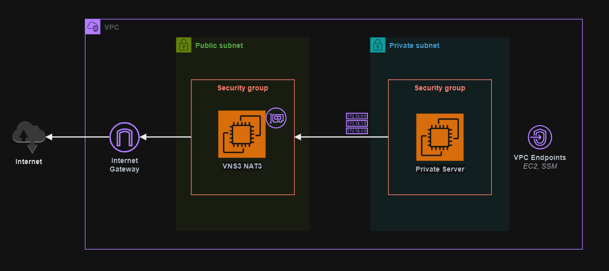

# VNS3 NATe

Cohesive Networks VNS3 NATe running on AWS.

> This project is based on `6.1.3-20230925`.




## Setup

Create a copy to the `.auto.tfvars` template to fine tune your deployment:

```sh
cp config/templates.tfvars .auto.tfvars
```

Create the SSH key pair to be associated with the VNS3 EC2 instance:

```sh
mkdir keys && ssh-keygen -f keys/vns3
```

## Deploy

Create the resources:

```sh
terraform init
terraform apply -auto-approve
```

"https://<instance-public-ip>:8000"

- Username: vnscubed
- Password: i-000d15ffc5c7d9370


## Server

```sh
aws ssm start-session --target <instance>
```


https://docs.cohesive.net/docs/nate/

https://aws.amazon.com/marketplace/pp/prodview-wf7yma4f6mdw4
https://aws.amazon.com/marketplace/pp/prodview-beu27g23xt4ok

https://docs.cohesive.net/tutorials/getting-started/
https://docs.cohesive.net/docs/cloud-setup/aws/

https://docs.cohesive.net/docs/vns3/aws-features/