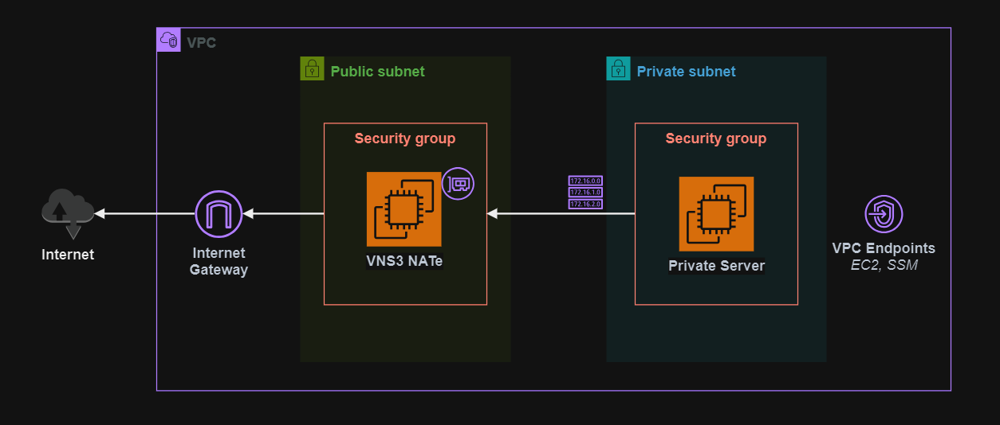

# VNS3 NATe

Terraform implementation of Cohesive Networks [VNS3 NATe][1] running on AWS.



The image is ready for use in the [AWS Marketplace][2]. A [free option][3] is also available with limited instances and throughput. Additional articles can be found for [getting started][4], [cloud setup][5], and [AWS features][6].

## Deploy

Create a copy to the `.auto.tfvars` template to fine tune your deployment:

```sh
cp config/templates.tfvars .auto.tfvars
```

Create the resources:

```sh
terraform init
terraform apply -auto-approve
```

The Web UI administration URL will be part of the output.

Connect to the admin panel:

```
https://<instance-public-ip>:8000
```

It will take a while for the box to boot:


Once booted, enter the credentials:

- Username: `vnscubed`
- Password: **Instance ID** (E.g.: i-012fsd8a9fsd823cv)


To test connections from the the private server, use SSM:

```sh
aws ssm start-session --target <instance>
```

## URL Filter

The VNS3 NATe box supports [URL filtering] for simple egress control. More details are provided in [this documentation][8].

[1]: https://docs.cohesive.net/docs/nate/
[2]: https://aws.amazon.com/marketplace/pp/prodview-beu27g23xt4ok
[3]: https://aws.amazon.com/marketplace/pp/prodview-wf7yma4f6mdw4
[4]: https://docs.cohesive.net/tutorials/getting-started/
[5]: https://docs.cohesive.net/docs/cloud-setup/aws/
[6]: https://docs.cohesive.net/docs/vns3/aws-features/
[7]: https://docs.cohesive.net/docs/nate/?_ga=2.187348392.1255134898.1715113453-1776422420.1715113453#what-is-included
[8]: https://cohesive.net/blog/replace-nat-with-nate-part-2/
